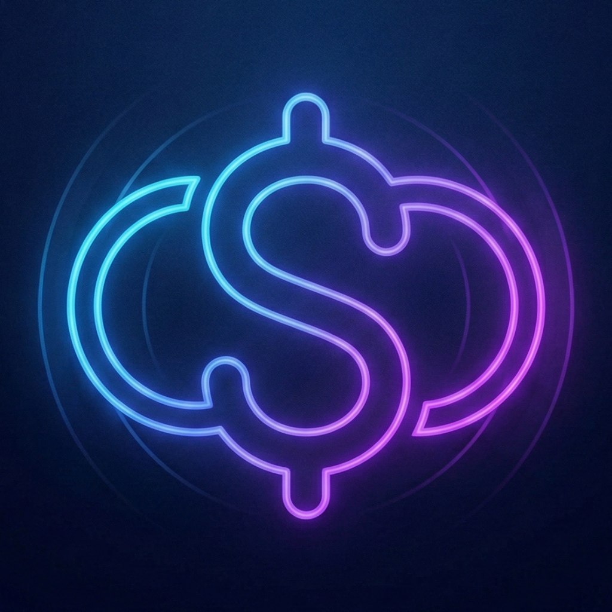

# 🔄 SubLoop

<div align="center">
  
  
  ### Minimalist Subscription Tracking App
  
  Track your subscriptions with style. Beautiful analytics, multi-currency support, and smart notifications.
  
  [](https://swift.org)
  [](https://www.apple.com/ios/)
  [](https://developer.apple.com/xcode/swiftui/)
  [](LICENSE)
</div>

---

## ✨ Features

### 📊 Visual Analytics
- **Interactive Charts**: Beautiful sector charts powered by SwiftUI Charts
- **Category Breakdown**: See your spending distribution by category
- **Real-time Updates**: Automatic chart updates when you add or edit subscriptions
- **Neon Gradient Design**: Modern, eye-catching UI with gradient colors

### 💱 Multi-Currency Support
- **4 Major Currencies**: USD ($), EUR (€), GBP (£), TRY (₺)
- **Persistent Preference**: Your currency choice is saved with AppStorage
- **Dynamic Formatting**: All prices automatically update when you change currency
- **Global Ready**: Perfect for international users

### 🔔 Smart Notifications
- **Payment Reminders**: Get notified 1 day before each payment
- **Local Notifications**: Privacy-first, no server required
- **Custom Scheduling**: Notifications based on your payment dates
- **Full Control**: Manage notification permissions easily

### 🎨 Beautiful Design
- **Dark Mode**: Sleek dark theme with deep navy background
- **Neon Accents**: Eye-catching blue and purple gradients
- **Smooth Animations**: Fade-in, scale, and transition effects
- **Haptic Feedback**: Tactile responses for every interaction
- **Splash Screen**: Professional app launch experience

### 📱 Core Functionality
- **Add Subscriptions**: Quick and easy subscription entry
- **Edit & Delete**: Full CRUD operations with swipe gestures
- **Category System**: 9 predefined categories (Entertainment, Productivity, etc.)
- **Icon Selection**: Choose from 20+ SF Symbols
- **Color Customization**: 8 beautiful accent colors
- **SwiftData Persistence**: Fast, efficient local storage

---

## 📸 Screenshots

<div align="center">
  
  
  
</div>

---

## 🚀 Getting Started

### Requirements
- **Xcode**: 15.0 or later
- **iOS**: 17.0 or later
- **Swift**: 5.9 or later

### Installation

1. **Clone the repository**
   ```bash
   git clone https://github.com/YOUR_USERNAME/SubLoop.git
   cd SubLoop
   ```

2. **Open in Xcode**
   ```bash
   open SubLoop.xcodeproj
   ```

3. **Build and Run**
   - Select your target device or simulator
   - Press `Cmd + R` to build and run
   - Grant notification permissions when prompted

---

## 🏗️ Architecture

### Tech Stack
- **Framework**: SwiftUI
- **Database**: SwiftData
- **Charts**: SwiftUI Charts
- **Notifications**: UserNotifications framework
- **Storage**: AppStorage for user preferences

### Project Structure
```
SubLoop/
├── SubLoop/
│   ├── ContentView.swift          # Main view with subscription list
│   ├── SplashScreenView.swift     # Animated splash screen
│   ├── SettingsView.swift         # Currency settings
│   ├── NotificationManager.swift  # Notification handling
│   ├── CategoryPicker.swift       # Category selection component
│   ├── SubLoopApp.swift          # App entry point
│   └── Assets.xcassets/          # Images and colors
├── README.md
└── .gitignore
```

### Key Components

#### Subscription Model
```swift
@Model
class Subscription {
    var id: UUID
    var name: String
    var icon: String
    var price: Double
    var currency: String
    var category: String
    var nextPaymentDate: Date
    var accentColorRed: Double
    var accentColorGreen: Double
    var accentColorBlue: Double
}
```

#### Currency Enum
```swift
enum Currency: String, CaseIterable {
    case usd = "USD"
    case eur = "EUR"
    case gbp = "GBP"
    case try_ = "TRY"
}
```

---

## 🎯 Usage

### Adding a Subscription
1. Tap the **+** button in the top right
2. Enter subscription details:
   - Name
   - Monthly price
   - Next payment date
   - Category
   - Icon
   - Accent color
3. Tap **Save Subscription**
4. Notification automatically scheduled

### Editing a Subscription
1. Tap on any subscription in the list
2. Modify the details
3. Tap **Update Subscription**
4. Changes saved and notification rescheduled

### Deleting a Subscription
1. Long-press on a subscription
2. Select **Delete** from the context menu
3. Subscription and its notification removed

### Changing Currency
1. Tap the **⚙️** Settings icon
2. Select your preferred currency
3. All prices update automatically

---

## 🎨 Design System

### Color Palette
- **Background**: `#0D0D26` (Deep Navy)
- **Card Background**: `#1A1A33` (Dark Purple)
- **Primary Gradient**: Blue (`#66B3FF`) → Purple (`#9966FF`)
- **Text**: White with varying opacity

### Typography
- **Title**: System Bold, 28pt
- **Heading**: System Semibold, 22pt
- **Body**: System Regular, 17pt
- **Caption**: System Medium, 14pt

### Animations
- **Fade-in**: 0.8s ease-in
- **Scale**: 0.8 → 1.0
- **Transition**: 0.5s ease-out

---

## 🔧 Configuration

### Notification Settings
Notifications are scheduled 1 day before each payment. To modify the timing, edit `NotificationManager.swift`:

```swift
// Change notification timing (currently 1 day before)
let notificationDate = calendar.date(byAdding: .day, value: -1, to: subscription.nextPaymentDate)
```

### Categories
Add or modify categories in `ContentView.swift`:

```swift
let availableCategories = [
    "Entertainment", 
    "Productivity", 
    "Cloud Storage", 
    "Music", 
    "Gaming", 
    "Fitness", 
    "News", 
    "Education", 
    "Other"
]
```

---

## 🤝 Contributing

Contributions are welcome! Here's how you can help:

1. **Fork the repository**
2. **Create a feature branch**
   ```bash
   git checkout -b feature/amazing-feature
   ```
3. **Commit your changes**
   ```bash
   git commit -m 'Add some amazing feature'
   ```
4. **Push to the branch**
   ```bash
   git push origin feature/amazing-feature
   ```
5. **Open a Pull Request**

### Development Guidelines
- Follow Swift style guide
- Write descriptive commit messages
- Add comments for complex logic
- Test on multiple devices
- Ensure dark mode compatibility

---

## 📝 Roadmap

### Upcoming Features
- [ ] Widget support for home screen
- [ ] Export data to CSV
- [ ] Subscription sharing between devices (iCloud sync)
- [ ] Annual/weekly billing cycles
- [ ] Custom notification times
- [ ] Spending trends and insights
- [ ] Budget limits and alerts
- [ ] More currency options
- [ ] Localization (Turkish, Spanish, French)
- [ ] iPad optimization

---

## 🐛 Known Issues

- None at the moment! 🎉

If you find a bug, please [open an issue](https://github.com/YOUR_USERNAME/SubLoop/issues).

---

## 📄 License

This project is licensed under the MIT License - see the [LICENSE](LICENSE) file for details.

```
MIT License

Copyright (c) 2026 SubLoop Team

Permission is hereby granted, free of charge, to any person obtaining a copy
of this software and associated documentation files (the "Software"), to deal
in the Software without restriction, including without limitation the rights
to use, copy, modify, merge, publish, distribute, sublicense, and/or sell
copies of the Software, and to permit persons to whom the Software is
furnished to do so, subject to the following conditions:

The above copyright notice and this permission notice shall be included in all
copies or substantial portions of the Software.

THE SOFTWARE IS PROVIDED "AS IS", WITHOUT WARRANTY OF ANY KIND, EXPRESS OR
IMPLIED, INCLUDING BUT NOT LIMITED TO THE WARRANTIES OF MERCHANTABILITY,
FITNESS FOR A PARTICULAR PURPOSE AND NONINFRINGEMENT. IN NO EVENT SHALL THE
AUTHORS OR COPYRIGHT HOLDERS BE LIABLE FOR ANY CLAIM, DAMAGES OR OTHER
LIABILITY, WHETHER IN AN ACTION OF CONTRACT, TORT OR OTHERWISE, ARISING FROM,
OUT OF OR IN CONNECTION WITH THE SOFTWARE OR THE USE OR OTHER DEALINGS IN THE
SOFTWARE.
```

---

## 👨‍💻 Author

**Efe Okumuş**
- GitHub: [@efeokumus](https://github.com/efeokumus)

---

## 🙏 Acknowledgments

- **Apple**: For SwiftUI, SwiftData, and SF Symbols
- **Swift Community**: For inspiration and best practices
- **You**: For checking out this project! ⭐

---

## 📞 Support

If you like this project, please consider:
- ⭐ Starring the repository
- 🐛 Reporting bugs
- 💡 Suggesting new features
- 🔀 Contributing code

---

<div align="center">
  Made with ❤️ and SwiftUI
  
  **SubLoop** - Track subscriptions, save money, live better.
</div>
